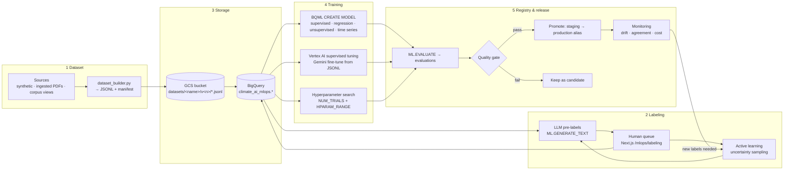
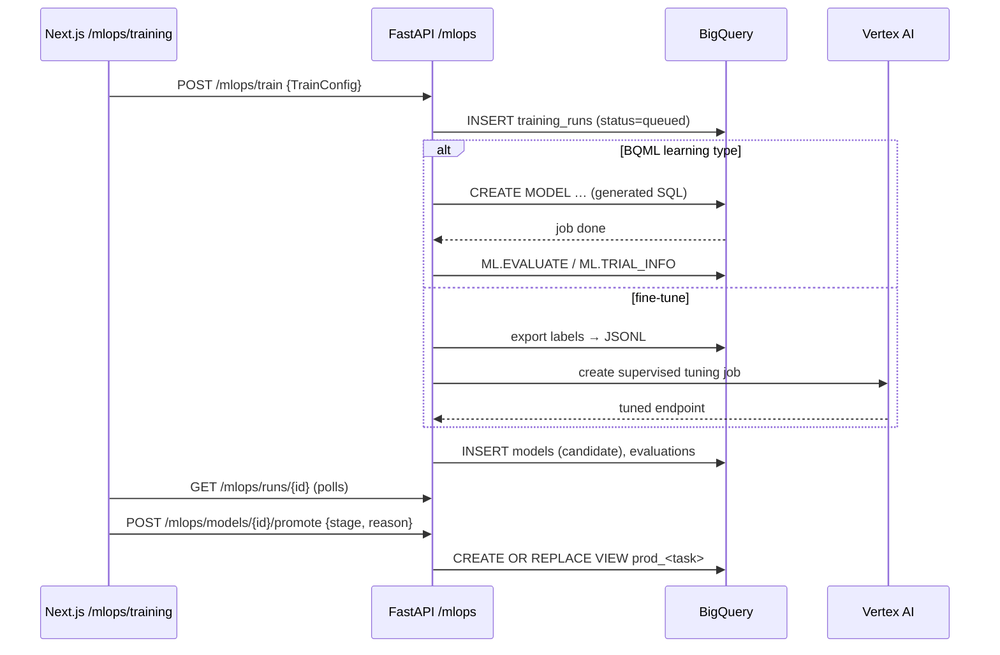

# ClimateReview AI — MLOps architecture

The MLOps layer makes every model in the app a *versioned, labelled, evaluated and promoted*
asset, controlled from the Next.js console. It follows the same principle as the reviewer
workspace: the machine proposes, the human decides, and every step leaves provenance.

## 1. The flow in one picture



## 2. Components

| Layer | Component | Responsibility |
|---|---|---|
| Data | `mlops/dataset_builder.py` | Builds a JSONL dataset from BigQuery (`corpus`, `corpus_embeddings`, `screening_labels`, …) or from local files. Writes `manifest.json` (schema, row count, content hash, source SQL, split fractions). Every dataset is `name@vN`, immutable once uploaded. |
| Storage | `mlops/gcs_store.py` | Uploads/downloads under `gs://<bucket>/datasets/<name>/v<N>/`. Bucket has versioning on; objects are never overwritten. |
| Load | `mlops/bq_loader.py` | `LOAD DATA` / load job from GCS URIs into `climate_ai_mlops.ds_<name>_v<N>` with the manifest schema; registers in `datasets`. |
| Labeling | `mlops/labeling.py` | Creates a label task from a dataset; pre-labels with Gemini (JSON prompt); serves the queue ordered by model uncertainty; records human labels; computes annotator agreement. |
| Training | `mlops/training.py` | Turns a `TrainConfig` (learning type + params) into BQML SQL or a Vertex tuning job; runs it; captures `ML.EVALUATE` / `ML.TRIAL_INFO`; writes `training_runs`, `models`, `evaluations`. |
| Registry | `mlops/registry.py` | BigQuery tables + `promote()` which repoints the `production` alias (a view) at the chosen model. |
| Orchestration | `mlops/pipeline.py` | Runs the stages in order for a `PipelineSpec`; each stage is idempotent and logs to `pipeline_runs`. Can be triggered from the UI, a Cloud Run job, or Cloud Scheduler. |
| Control plane | `api_mlops.py` | FastAPI router `/mlops/*`. |
| Console | `web/app/mlops/*` | Overview (pipeline status), Datasets, Labeling, Training, Models, Runs. |

## 3. Learning types the console offers

| Learning type | Where | BQML `model_type` / Vertex | Typical target in this app |
|---|---|---|---|
| Supervised classification | BQML | `LOGISTIC_REG`, `BOOSTED_TREE_CLASSIFIER`, `DNN_CLASSIFIER`, `AUTOML_CLASSIFIER` | relevance screening; evidence_type; region |
| Regression | BQML | `LINEAR_REG`, `BOOSTED_TREE_REGRESSOR`, `DNN_REGRESSOR` | credibility score; effect size; confidence level (ordinal→numeric) |
| Unsupervised | BQML | `KMEANS`, `PCA`, `AUTOENCODER` (anomaly) | evidence-map clusters; embedding compression; outlier docs |
| Time series | BQML | `ARIMA_PLUS`, `ARIMA_PLUS_XREG` | living-evidence forecasts |
| Fine-tuning | Vertex AI | supervised tuning of Gemini from a JSONL of `contents` | metadata extraction; adaptation-outcome extraction in the project's own style |
| Hyperparameter tuning | BQML | `NUM_TRIALS`, `HPARAM_RANGE`, `HPARAM_CANDIDATES` | any of the above |
| Semi-supervised / active | pipeline | uncertainty sampling → labeling queue → retrain | screening with few labels |

`TrainConfig` (see `training.py`) is the single schema the UI form, the API and the SQL
generator share, so a run started from the console is byte-identical to one started from CLI.

## 4. Storage layout

```
gs://ai-ippc-climate-mlops/
  datasets/<name>/v<N>/data-00000.jsonl        immutable
  datasets/<name>/v<N>/manifest.json
  labels/<task_id>/labels.jsonl                 human labels export
  tuning/<run_id>/train.jsonl, validation.jsonl Gemini tuning inputs
  models/<model_id>/model_card.md

BigQuery ai-ippc.climate_ai_mlops
  datasets(dataset_id, name, version, gcs_uri, bq_table, schema_json, n_rows, content_hash, created_by, created_at, notes)
  label_tasks(task_id, dataset_id, label_field, label_space, instructions, status, created_at)
  labels(label_id, task_id, row_id, label, source 'llm'|'human', annotator, confidence, labeled_at)
  training_runs(run_id, dataset_id, config_json, learning_type, status, bq_model|vertex_job, started_at, finished_at, error)
  models(model_id, run_id, name, learning_type, stage 'candidate'|'staging'|'production'|'retired', created_at)
  evaluations(eval_id, model_id, metrics_json, evaluated_at)
  pipeline_runs(pipeline_run_id, spec_json, stage, status, log, started_at, finished_at)
  ds_<name>_v<N>                                 the loaded dataset tables
```

## 5. Quality gates and promotion

* A model can move to `staging` only with an `evaluations` row.
* Promotion to `production` requires metrics ≥ thresholds in the spec (e.g. recall ≥ 0.9 for
  screening, Davies–Bouldin ≤ 1.2 for clusters) **and** a human click with a reason.
* The `production` alias is a BigQuery view `climate_ai_mlops.prod_<task>` that the app's
  `ML.PREDICT` calls read from, so promotion never edits application code.
* Rollback = promote the previous model.

## 6. Monitoring loop

Nightly view `monitoring_daily`: prediction distribution vs training distribution (PSI on
`p_relevant`), LLM↔model agreement on the uncertain band, human override rate, bytes billed
per model. Override rate > 20% or PSI > 0.2 raises a "label more" task in the console, which
feeds active learning.

## 7. Sequence: a training run from the console



## 8. Security and cost boundaries

* Service account for Cloud Run has `bigquery.jobUser`, `bigquery.dataEditor` on the two
  datasets, `storage.objectAdmin` on the one bucket, `aiplatform.user`. Nothing wider.
* The UI never holds credentials; it only talks to the API.
* Every training run records `total_bytes_billed` and `slot_ms` so the cost ledger from the
  research layer covers MLOps too.
